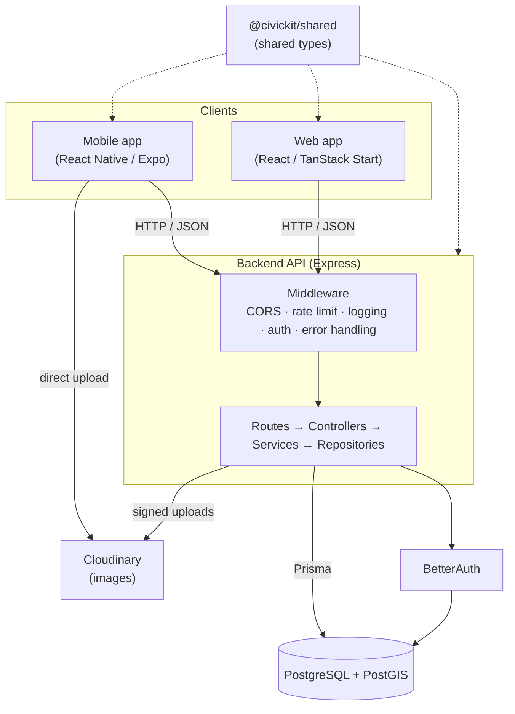
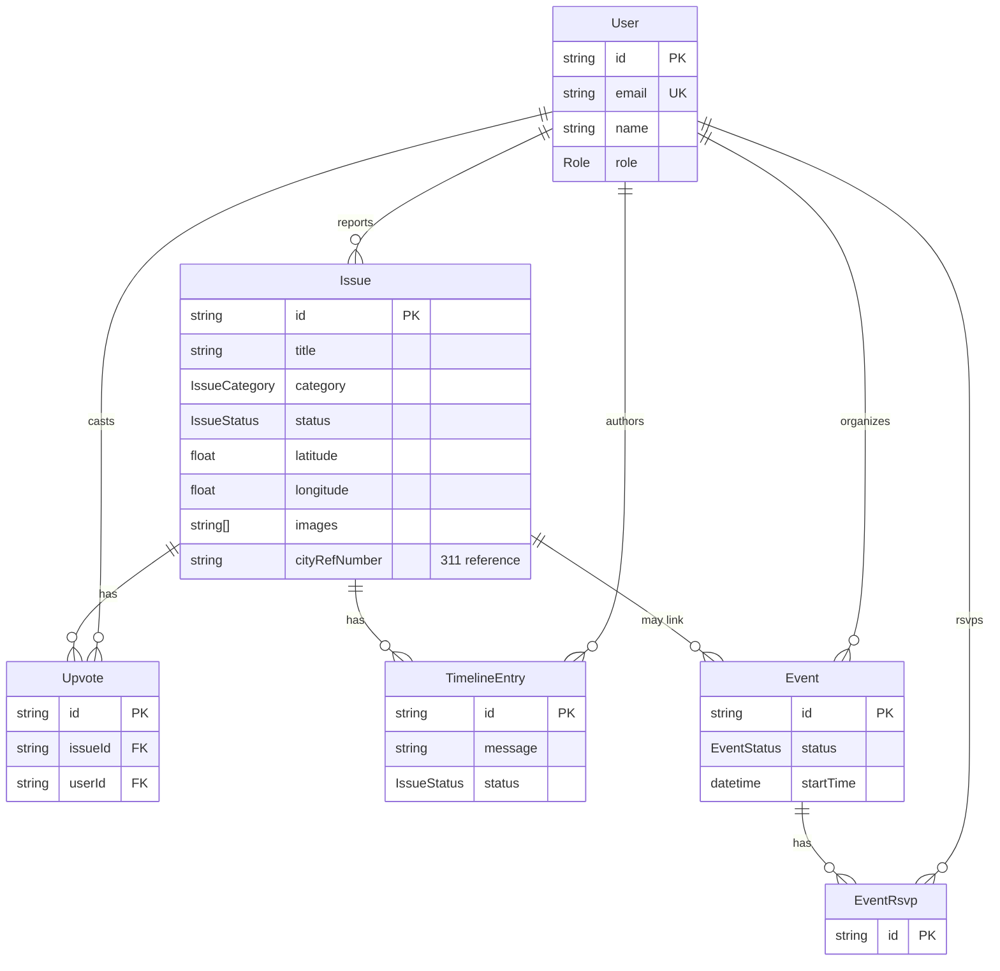
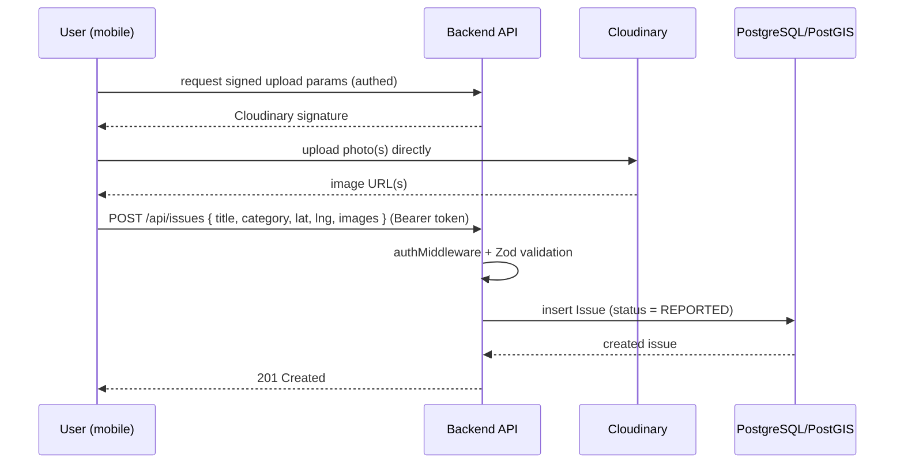

# CivicKit Architecture

This document describes how CivicKit is put together: the workspaces in the
monorepo, the backend's layered design, the data model, and the core request
flows. It is meant as an orientation for new contributors — pair it with the
[Setup Guide](SETUP.md) to get a local environment running.

## Overview

CivicKit is an open-source civic-engagement platform for reporting local issues
(potholes, broken streetlights, graffiti, …) and organizing community action
around them. It is a **monorepo** with four workspaces:

| Workspace | What it is | Stack |
|-----------|------------|-------|
| `backend/` | REST API + database access | Node.js, Express 5, TypeScript, Prisma, PostgreSQL + PostGIS |
| `mobile/`  | The primary client | React Native (Expo), React Navigation, TanStack Query |
| `web/`     | Marketing / web client | React, TanStack Start + Vite, deployed to Cloudflare Workers |
| `shared/`  | Types shared across clients | TypeScript package (`@civickit/shared`) |

External services: **Cloudinary** for image storage, **BetterAuth** wired into
the auth layer, and **PostGIS** for geospatial queries.

## System context



## Backend layered architecture

Each backend request flows through a consistent set of layers. This keeps HTTP
concerns, business logic, and data access separate and testable.

```
Route → Middleware → Controller → Service → Repository → Prisma → PostgreSQL/PostGIS
```

- **Routes** (`backend/src/routes/`) — declare endpoints and attach middleware
  (e.g. `issue.routes.ts` wires `authMiddleware`, `validateBody`, and
  `requirePermission`).
- **Middleware** (`backend/src/middleware/`) — `auth.middleware.ts` (JWT check),
  `authorize.middleware.ts` (`requirePermission`, role-based), `validate.ts`
  (Zod body validation), `logger.middleware.ts`, `error.middleware.ts`.
- **Controllers** (`backend/src/controllers/`) — parse the request, call a
  service, shape the HTTP response.
- **Services** (`backend/src/services/`) — business logic (validation, error
  mapping, orchestration). Unit-tested under `services/__tests__/unit/`.
- **Repositories** (`backend/src/repositories/`) — all database access. The
  PostGIS geospatial query for nearby issues lives in `issue.repository.ts`.

`server.ts` composes the app: CORS, rate limiting (general + a stricter limiter
on the auth surface), request logging, the route modules, a 404 handler, and a
global error handler. BetterAuth is mounted separately at
`/api/better-auth/auth/*`.

### Authorization

Roles (`REPORTER`, `ADMIN`) and their permissions are defined in
`backend/src/config/permissions.ts`. `requirePermission(...)` loads the caller's
role fresh from the database on each request (so access can be revoked
immediately) and gates sensitive actions such as `update:issue_status`.

## Data model

The schema lives in `backend/prisma/schema.prisma`. Core entities:



- **Issue** carries location (`latitude`/`longitude`, plus optional
  `address`/`district`/`subregion`), an array of Cloudinary image URLs, a
  lifecycle `status`, and `cityRefNumber` for 311 integration.
- **IssueStatus**: `REPORTED → ACKNOWLEDGED → IN_PROGRESS → RESOLVED → CLOSED`
  (plus `COMMUNITY_RESOLVED`).
- **TimelineEntry** records each status update with an optional message and
  images, giving every issue an auditable history.
- **Upvote** has a unique `(issueId, userId)` constraint — one vote per user.
- **Event** / **EventRsvp** support community organizing and can optionally link
  to an issue.
- BetterAuth manages its own `Session`, `Account`, and `Verification` tables.

## Core flow: reporting an issue



Browsing uses `GET /api/issues/nearby?lat&lng&radius`, which runs a PostGIS
proximity query in `issue.repository.ts` to return issues near the user. Users
can then upvote issues and — for admins — advance an issue's status, each status
change appended as a `TimelineEntry`.

## Directory guide

```
civickit/
├── backend/          Express API (routes, controllers, services, repositories)
│   ├── prisma/       schema.prisma + migrations
│   └── src/          app code (see layered architecture above)
├── mobile/           React Native (Expo) app
├── web/              React + TanStack Start web app
├── shared/           @civickit/shared — types used by all clients
└── docs/             SETUP.md, CONTRIBUTING.md, USER_FLOWS.md, SECURITY.md, this file
```

## Running it locally

See the [Setup Guide](SETUP.md). In short: start the Postgres/PostGIS container,
configure `backend/.env`, then run the backend and the client you need.
